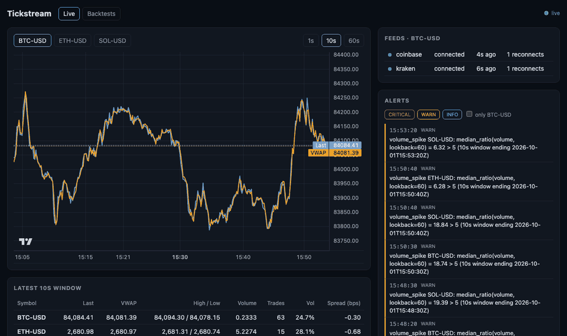
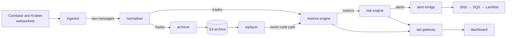

# Tickstream

[](https://github.com/anibitri/tickstream/actions/workflows/ci.yml)
[](go.mod)
[](LICENSE)

A real-time market data platform written in Go. It reads live crypto trades
from Coinbase and Kraken, works out market statistics every second, raises
alerts when something unusual happens, and keeps every trade so past days can
be replayed through the same code for backtesting.

<!-- TODO(you): add a dashboard GIF here, e.g.  -->

## Things to change

> Temporary checklist for the repo owner. Delete this section when done.

- [ ] **Add repository secrets** (Settings → Secrets and variables → Actions):
      `LOCALSTACK_AUTH_TOKEN` (needed by the `infra` and `integration` workflows)
      and optionally `CODECOV_TOKEN` (coverage reports).
- [ ] **Dashboard GIF** at the top of this README, and a **Jaeger trace
      screenshot** in [docs/architecture.md](docs/architecture.md#observability).
- [ ] **Live latency**: run `make up` for about an hour, read p50/p95/p99 from the
      Grafana panel "Receive → metric published", and fill in
      [docs/benchmarks.md](docs/benchmarks.md#latency) and the results table below.
- [ ] **Real-data backtest**: after the stack has archived a few hours of live
      trades, run the backtester against S3 and add the result below.
- [ ] **Portfolio paper link** in [docs/backtesting.md](docs/backtesting.md).
- [ ] *Optional:* a Discord/Slack webhook in `.env` (`ALERT_WEBHOOK_URL`).
- [ ] *Optional:* one-off real AWS deploy: edit [infra/aws.tfvars](infra/aws.tfvars)
      (bucket name, budget email), `terraform apply -var-file=aws.tfvars`,
      take screenshots, then `terraform destroy -var-file=aws.tfvars`.
- [ ] *Optional:* your full name instead of `anibitri` in [LICENSE](LICENSE).

## How it works



1. **ingestor** keeps a websocket open to each exchange and passes every trade
   message to Kafka unchanged. If a connection drops it reconnects, waiting a
   little longer after each failure, and raises an alert about the gap.
2. **normaliser** turns each exchange's format into one common `Trade`, drops
   duplicates and sends anything it can't read to a dead-letter topic.
3. **metrics-engine** groups trades into 1s, 10s and 60s windows and computes
   VWAP, volume, volatility, price range and the price gap between exchanges.
4. **risk-engine** checks the metrics against rules written in YAML
   ([deploy/rules.yaml](deploy/rules.yaml)), such as "price moved more than 4
   standard deviations", and publishes alerts. They are delivered through
   SNS, SQS and a Lambda function that stores each alert exactly once.
5. **archiver** saves every trade to S3 as Parquet files, so any past period
   can be replayed through steps 3 and 4 again.
6. **api-gateway** serves a REST API, a live websocket and the React dashboard.

More detail: [architecture](docs/architecture.md) ·
[design decisions](docs/decisions.md) · [backtesting](docs/backtesting.md) ·
[benchmarks](docs/benchmarks.md).

## Quickstart

Needs Docker (about 6 GB of memory for Docker) and a free
[LocalStack](https://app.localstack.cloud) auth token, which stands in for AWS.

```bash
git clone https://github.com/anibitri/tickstream && cd tickstream
cp .env.example .env    # then paste your LocalStack token into .env
make up
```

`make up` starts Kafka and LocalStack, creates the topics, runs Terraform
against LocalStack, and starts the services (about 2½ minutes once the images
are downloaded). Then open:

| | |
|---|---|
| Dashboard and API | http://localhost:8080 |
| Grafana | http://localhost:3000 |
| Jaeger (traces) | http://localhost:16686 |
| Kafka UI | http://localhost:8081 |

`make down` stops everything. `make help` lists the other commands.

## Results

Measured on an Apple M2 laptop with 8 GB of RAM ([details](docs/benchmarks.md)).

| | |
|---|---|
| Throughput through Kafka (replay at full speed) | **~190,000 trades/s** end to end (target was 50,000) |
| Throughput in one process | ~520,000 trades/s, 174 MB of memory |
| Metrics engine alone | ~715,000 trades/s on one core |
| Kill metrics-engine mid-replay and restart it | Output identical to an uninterrupted run (same SHA-256) |
| Restart the Kafka broker | Metrics flowing again 6 s after the broker is back |
| Cut an exchange connection | Reconnects with backoff and raises a `feed_gap` alert |
| Metrics checked against pandas | 414 windows, 0 mismatches |
| Live latency (receive → metric published) | *not measured yet* |

## Design choices

- **Windows use the exchange's timestamp, not the server clock.** Replaying a
  day at 100× speed therefore gives exactly the same results as the live run.
- **Prices use exact decimals, never floats.** Floats can't store most decimal
  numbers exactly, and the small errors add up across thousands of trades.
- **Nothing is lost if a service crashes.** A service only marks a message as
  done after its results are safely stored. After a restart it re-reads from
  that point, and repeats are harmless because every write can be done twice
  safely.
- **Restarts rebuild state exactly.** The metrics and risk engines save a small
  checkpoint with each Kafka commit. Randomised tests, an integration test
  against real Kafka and a chaos test all check that a restarted engine
  produces exactly the same output as one that never stopped.

Why each choice was made, and what it costs: [docs/decisions.md](docs/decisions.md).

## Testing

```bash
go test ./...                                  # unit, property and golden-file tests
go test -tags integration ./internal/...       # real Kafka and LocalStack (Docker, token in env)
make reference                                 # compare the metrics with a pandas implementation
cd dashboard && npm ci && npm test             # dashboard
scripts/chaos.sh                               # crash experiments against a running stack
```

CI runs the Go tests with the race detector, the linters, the protobuf
checks, the pandas comparison, the dashboard tests and a Playwright smoke
test on every push, plus the integration tests and Terraform checks
(`terraform validate`, TFLint, Checkov) where relevant.

## Backtesting

`testdata/archive` holds a small synthetic dataset (20 minutes, 3 symbols). It
is a random walk, so it has no trading edge; it exists to test the pipeline.

```bash
make backtest-demo    # writes reports/demo/report.md
```

The report scores each alert rule and a simple mean-reversion signal with
walk-forward testing: settings are tuned on earlier blocks of time and only
ever scored on the block that follows. See [docs/backtesting.md](docs/backtesting.md).

## Repository layout

| Folder | Contents |
|---|---|
| `cmd/` | One folder per service: `main.go` plus any code only that service uses |
| `internal/` | Code shared between services: exchange adapters, metrics, rules, Kafka, storage, replay |
| `proto/` | Message schemas (Protocol Buffers) |
| `dashboard/` | React + TypeScript dashboard |
| `infra/` | Terraform for S3, DynamoDB, SNS, SQS, Lambda and IAM |
| `deploy/` | Docker Compose, Prometheus and Grafana config, alert rules |
| `docs/` | Architecture, decisions, backtesting method, benchmarks |
| `scripts/` | Topic setup, chaos experiments, benchmark, pandas check |
| `testdata/` | Recorded exchange messages, the synthetic fixture and the golden metrics |

## Limitations

- AWS services run on LocalStack, and Kafka is a single local broker. A
  production setup would use a managed Kafka (e.g. MSK) with replication,
  run the services on ECS or Kubernetes across availability zones, and keep
  secrets in a secrets manager.
- Trades that arrive more than 500 ms after their window closes are left out
  of the metrics (they are still archived).
- The bundled backtest data is synthetic. Nothing here is investment advice
  or meant for real trading.

## Tech stack

Go · Kafka (KRaft) · Protocol Buffers · AWS S3, DynamoDB, SNS, SQS and Lambda
via LocalStack · Terraform · Docker Compose · Prometheus, Grafana and
OpenTelemetry/Jaeger · React, TypeScript and Vite · GitHub Actions

## License

[MIT](LICENSE)
