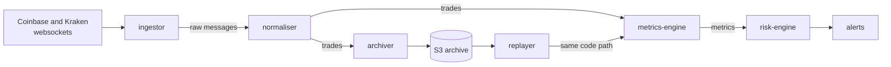

# Tickstream

A real-time market data platform written in Go. It reads live crypto trades
from Coinbase and Kraken, works out market statistics every second, raises
alerts when something unusual happens, and keeps every trade so past days can
be replayed through the same code for backtesting.

> **Status: work in progress.** All services, replay and backtesting are built
> and tested. The dashboard and the infrastructure (Terraform, Docker Compose)
> are still being written (see [Progress](#progress)).

## How it works



1. **ingestor** keeps a websocket open to each exchange and passes every trade
   message to Kafka unchanged. If a connection drops it reconnects, waiting a
   little longer after each failure, and raises an alert about the gap.
2. **normaliser** turns each exchange's format into one common `Trade`, drops
   duplicates and sends anything it can't read to a dead-letter topic.
3. **metrics-engine** groups trades into 1s, 10s and 60s windows and computes
   VWAP, volume, volatility, price range and the price gap between exchanges.
4. **risk-engine** checks the metrics against rules written in YAML, such as
   "price moved more than 4 standard deviations", and publishes alerts.
5. **archiver** saves every trade to S3 as Parquet files, so any past period
   can be replayed through steps 3 and 4 again.

## Design choices

- **Windows use the exchange's timestamp, not the server clock.** Replaying a
  day at 100× speed therefore gives exactly the same results as the live run.
- **Prices use exact decimals, never floats.** Floats can't store most decimal
  numbers exactly, and the small errors add up across thousands of trades.
- **Nothing is lost if a service crashes.** A service only marks a message as
  done after its results are safely stored. After a restart it re-reads from
  that point, and duplicates are harmless because every write can be repeated
  safely.
- **Restarts rebuild state exactly.** The metrics and risk engines save a small
  checkpoint with each Kafka commit. Randomised tests check that a restarted
  engine produces exactly the same output as one that never stopped.

## Repository layout

| Folder | Contents |
|---|---|
| `cmd/` | One folder per service |
| `internal/` | Code shared between services: exchange adapters, metrics, rules, Kafka, storage |
| `proto/` | Message schemas (Protocol Buffers) |
| `deploy/` | Runtime configuration, e.g. alert rules |
| `testdata/` | Real messages recorded from the exchanges, used in tests |

## Running the tests

Requires Go 1.26 or newer.

```bash
go test ./...
```

The metrics are also checked against an independent pandas implementation:

```bash
python3 -m venv .venv && .venv/bin/pip install -r scripts/requirements.txt
.venv/bin/python scripts/reference_check.py
```

## Backtesting

`testdata/archive` holds a small synthetic dataset (20 minutes, 3 symbols). It
is a random walk, so it has no trading edge; it exists to test the pipeline.

```bash
go run ./cmd/backtester -dir testdata/archive -run-id demo \
  -from 2026-10-04T13:50:00Z -to 2026-10-04T14:10:00Z
```

The report (`reports/demo/report.md`) scores each alert rule and a simple
mean-reversion signal with walk-forward testing: settings are tuned on earlier
blocks of time and only ever scored on the block that follows.

## Progress

- [x] Exchange adapters, ingestor and normaliser
- [x] Metrics engine and risk engine
- [x] Storage layer (Parquet files, DynamoDB tables)
- [x] Archiver, metrics-sink and alert delivery (SNS → SQS → Lambda)
- [x] REST/WebSocket API
- [x] Replay and walk-forward backtesting
- [ ] React dashboard
- [ ] Terraform (LocalStack), Docker Compose, Grafana dashboards
- [ ] CI, integration tests, benchmarks

## Tech stack

Go · Kafka · Protocol Buffers · AWS S3, DynamoDB, SNS, SQS and Lambda (run
locally with LocalStack) · Terraform · Prometheus, Grafana and OpenTelemetry ·
React and TypeScript

## License

[MIT](LICENSE)
