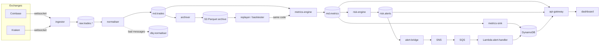
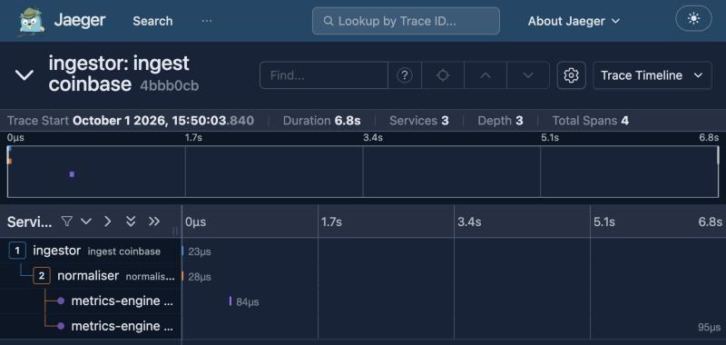

# Architecture



Rounded boxes with brackets are Kafka topics or storage. Every Go service is a
small binary in `cmd/`; shared code lives in `internal/`.

## Services

| Service | Reads | Writes | What it does |
|---|---|---|---|
| ingestor | exchange websockets | `raw.trades.<exchange>`, `md.feed_health` | Keeps one connection per exchange, reconnects with backoff, publishes messages unchanged plus the receive time |
| normaliser | `raw.trades.*` | `md.trades`, `dlq.normaliser` | Converts each exchange's format to one `Trade`, validates it, drops duplicates |
| metrics-engine | `md.trades` | `md.metrics` | 1s/10s/60s event-time windows: VWAP, volume, volatility, range, cross-exchange spread |
| risk-engine | `md.metrics` | `risk.alerts` | Checks YAML rules, applies cooldowns, gives each alert a repeatable ID |
| archiver | `md.trades` | S3 | Writes Parquet files per exchange, symbol and hour |
| metrics-sink | `md.metrics`, `md.feed_health` | DynamoDB | Stores the latest metrics and feed health |
| alert-bridge | `risk.alerts` | SNS | Forwards alerts to AWS |
| alert-handler | SQS | DynamoDB, webhook | Lambda: stores each alert once, notifies Discord/Slack |
| api-gateway | Kafka, DynamoDB, S3 | HTTP, websocket | Serves the dashboard, the REST API and a live stream of metrics and alerts |
| replayer | S3 | `replay.<run_id>.trades` | Replays a time range at 1×, 10× or full speed |
| backtester | S3 | report files, S3 | Runs the engines over history and scores rules and a signal |

## Kafka topics

All topics are keyed by symbol, so every trade for a symbol goes to the same
partition and stays in order.

| Topic | Partitions | Kept for | Contents |
|---|---|---|---|
| `raw.trades.coinbase`, `raw.trades.kraken` | 6 | 1 day | Exchange messages, untouched |
| `md.trades` | 6 | 7 days | Canonical trades (protobuf) |
| `md.metrics` | 6 | 7 days | One record per symbol per closed window |
| `md.feed_health` | 3 | 1 day | Connection status every 5 s |
| `risk.alerts` | 3 | 30 days | Alerts |
| `dlq.*` | 1 | 30 days | Messages that could not be processed, with the reason |
| `replay.<run_id>.*` | 6 | 1 day | Isolated topics for a replay run |

Message schemas are in [proto/tickstream/v1](../proto/tickstream/v1/tickstream.proto).

## Storage

**S3** (`tickstream-archive` bucket):

```
trades/exchange=coinbase/symbol=BTC-USD/date=2026-10-04/hour=13/part-<first offset>-<last offset>.parquet
backtests/<run_id>/report.json
backtests/<run_id>/report.md
```

The folder names follow the Hive convention, so DuckDB, pandas or Spark can
read the archive directly, for example:

```sql
SELECT symbol, count(*) FROM 'trades/**/*.parquet' GROUP BY symbol;
```

**DynamoDB:**

| Table | Key | Holds |
|---|---|---|
| `latest_metrics` | symbol + window size | Latest window; a write only succeeds if it is newer |
| `alerts` | symbol + `<window end>#<alert id>` | Alert history, deleted after 30 days |
| `feed_health` | exchange + symbol | Connection status for the dashboard |

## Local setup

`make up` starts everything with Docker Compose ([deploy/compose.yml](../deploy/compose.yml)):
Kafka, LocalStack (a local copy of the AWS services), a one-off container that
creates the Kafka topics, another that runs Terraform ([infra/](../infra)) against
LocalStack, the services, Prometheus, Grafana and Jaeger.

## Observability

- **Metrics:** each service serves Prometheus metrics on port 9100. Grafana
  has one dashboard with pipeline, feed, error and market sections.
- **Traces:** OpenTelemetry context travels in Kafka headers, so one sampled
  trade can be followed from ingestor to alert in Jaeger (1% of trades are
  sampled).



*One Coinbase trade in Jaeger: received by the ingestor, normalised, then
counted in the 1s window (closed 0.4 s later) and the 10s window (6.8 s later).*
- **Logs:** structured JSON, with the trace ID on every line.
